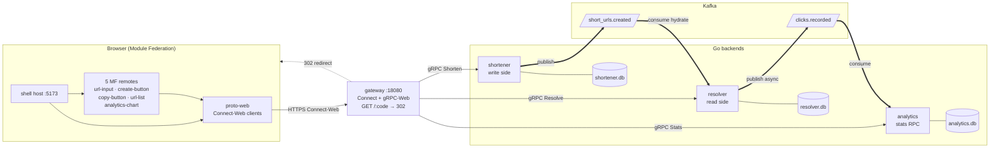

# unnecessary complexity

A URL shortener that didn't need any of this.

It's an event-sourced, multi-language, multi-process system with Kafka, gRPC, Module Federation, three SQLite databases, six frontend apps, kind/Kustomize manifests, and a build-tagged integration suite. The problem it solves fits in fifty lines of any language. That's the joke.

It's also the point. Every pattern engineers argue about — write/read separation, event sourcing, eventual consistency, micro-frontends, Connect/gRPC, multi-module Go workspaces — is wired up in a problem small enough to read in an afternoon. Each piece can be lifted out and reasoned about on its own.

## Architecture



- **Solid arrows** — synchronous RPC over Connect/gRPC.
- **Dashed arrow** — the `GET /:code` 302 redirect.
- **Thick arrows** — async Kafka events.
- **Cylinders** — each backend's own SQLite. Independent stores. Resolver and analytics are eventually consistent with shortener.

## What's in it

**Backend** — Go workspace, four services, two shared modules.

- `services/shortener` — write side. Owns the canonical store. Publishes `short_urls.created` after every successful insert.
- `services/resolver` — read side. Hydrated from Kafka into its own SQLite. Fires `clicks.recorded` async on every resolve (5s timeout, separate context).
- `services/analytics` — consumes `clicks.recorded` into a clicks fact table. Exposes a `Stats` RPC with daily aggregation and date filters.
- `services/gateway` — HTTP/Connect/gRPC-Web front door. Holds gRPC clients to all three backends. Also owns the `GET /<code>` 302 redirect — the only HTTP handler outside the Connect surface.
- `services/platform-events` — Kafka publisher (`segmentio/kafka-go`), generic typed consumer, in-memory fakes for tests, topic constants.
- `services/proto` — generated Connect/gRPC stubs. Single source of truth, never edited by hand.

**Frontend** — pnpm workspace under `frontend/`, Module Federation at runtime.

- `apps/shell` is the host. Five remotes (`mf-url-input`, `mf-create-button`, `mf-copy-button`, `mf-url-list`, `mf-analytics-chart`) ship independently and share React/ReactDOM/React Router as singletons.
- `packages/proto-web` exports a `createClients({baseUrl})` factory that returns Connect-Web clients. Every component accepts an injectable `clients` prop so tests can swap fakes in.

**Infra & tooling** — Kustomize manifests in `k8s/base`, a `kind` cluster up/down script, and a `make dev-up` that brings up Kafka in Docker, all four Go backends, and six frontend dev servers in one go.

**Tests** — unit tests in each Go module. `tests/integration` is gated behind the `integration` build tag so `make ci` never tries to compile it.

## Run it

One-time setup, then bring the local stack up:

```bash
make tools             # installs buf, protoc plugins, golangci-lint
make proto             # regenerate stubs (run after editing .proto)
make dev-up            # Kafka + backends + frontend dev servers
make dev-status        # who's alive
make dev-down          # stop everything
```

Then open `http://localhost:5173`. Short links resolve via the gateway at `http://localhost:18080/<code>`.

CI-equivalent and end-to-end checks:

```bash
make ci                # buf lint + golangci-lint + go test -race + go build
make integration-test  # spins up kind, deploys, port-forwards, runs e2e, tears down
```

`MINIMAL_FRONTEND=1`, `SKIP_FRONTEND=1`, `SKIP_KAFKA=1` are knobs on `make dev-up` for partial bring-up. Process state lives in `.run/` (gitignored).

## Things worth reading

- **Idempotency contract** (`services/shortener/internal/service`). No key → fresh row every call. Same `(owner_id, idempotency_key)` → returns the previously created row. Same key, different owners → two distinct rows (key is scoped to owner via a partial unique index). Race resolver: the loser catches `ErrDuplicateIdempotencyKey` and re-reads to return the winner's code.
- **Code generation and collisions**. Codes are random 8-char base62 from `crypto/rand` — not a hash of the URL, so the same long URL gives a different code each call (unless an idempotency key says otherwise). The `code` column is a primary key, so a collision on insert raises `ErrDuplicateCode`; `Shorten` catches it, regenerates, and retries up to `maxRetries`. After that, the request fails with `Internal: exhausted code-generation retries`. At length 8 the space is ~2.18×10¹⁴ — this is a teaching loop more than a real concern.
- **Eventual consistency hop**. Shortener writes its row, then publishes. Publish failure is logged, not rolled back — the write is the source of truth. Resolver and analytics catch up via Kafka. Integration tests use `require.Eventually` with `INTEGRATION_PROPAGATION_TIMEOUT` (default 30s).
- **MF async-bootstrap split**. `apps/shell/src/index.tsx` is one line: `import('./bootstrap.js')`. The real `createRoot(...).render(<App />)` lives in `bootstrap.tsx`. Without the split, Module Federation throws `RUNTIME-006` and renders a blank page — shared singletons can't satisfy a synchronous import before the federation runtime initialises.
- **Kafka topic creation**. The `apache/kafka:3.7.0` image doesn't auto-create topics on first publish, despite `KAFKA_AUTO_CREATE_TOPICS_ENABLE=true`. `scripts/dev-up.sh` pre-creates `short_urls.created` and `clicks.recorded`. New topic? Register it in `services/platform-events/events/topics.go` and in the dev-up topic-creation loop.

`CLAUDE.md` has the long version of all the conventions, including the build-tag layout, generated-stub policy, and a Vitest gotcha for the clipboard tests.

## Why

It's easier to teach a hard pattern in a small problem than in a real one. The smallness is what makes the parts visible.
